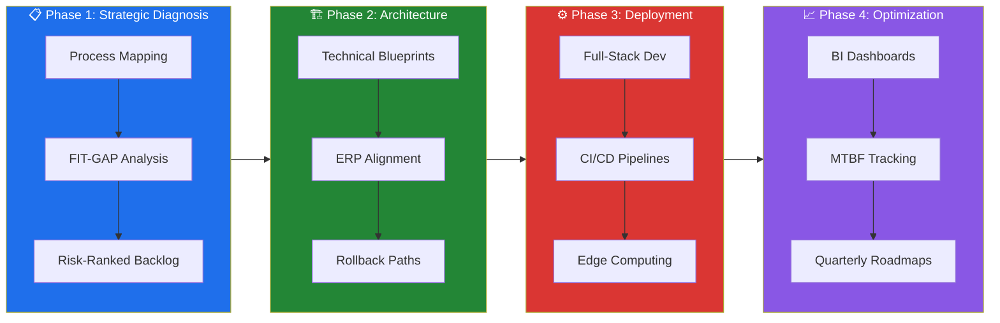

# 👋🏻 Hi, I'm Dhillan

**DevOps Engineer**

I build CI/CD pipelines, cloud infrastructure, and automation tools that bridge the gap between development and operations. Currently focused on SAP integrations, cloud-native deployments, and AI-powered tooling — usually with a cup of coffee in hand. ☕

Currently building at [Digital Consultancy Solutions](https://dcs-web-kappa.vercel.app/) — engineering excellence powered by technology.

---

## 🚀 What I Work On

| Area | Focus | Tools |
|------|-------|-------|
| **Cloud & Infrastructure** | Hybrid cloud (AWS/Azure), Kubernetes, Terraform, on-premise + edge | Docker, Istio, Helm, OPC-UA, MQTT |
| **CI/CD & Automation** | Pipeline design, GitOps, Infrastructure as Code | GitHub Actions, ArgoCD, Azure DevOps |
| **Observability** | Monitoring, tracing, logging at scale | Prometheus, Grafana, Jaeger |
| **SAP Enterprise Integration** | S/4HANA PM/MM/CO modules, asset traceability, predictive maintenance | Python, PostgreSQL, SAP BTP |
| **Applied AI & LLM** | Predictive maintenance, document classification, LLM orchestration, BI dashboards | OpenAI API, TensorFlow, Power BI |
| **Expert-Led Systems** | Oil & Gas, Chemical, Mining, Food & Beverage, Energy — industrial systems and asset-heavy operations | OPC-UA, MQTT, SCADA, PI System, AspenTech |

---

## 🏗️ Our Framework

**4 phases from SOW to production insight in 90 days:**

1. **Strategic Diagnosis & Audit** — Process mapping, FIT-GAP analysis, risk-ranked opportunity backlog
2. **Integrative Solution Architecture** — Technical blueprints, ERP alignment, rollback paths documented
3. **Agile Engineering & Deployment** — Full-stack dev, CI/CD pipelines, edge computing, operator runbooks
4. **Continuous Insight & Optimization** — BI dashboards, MTBF tracking, quarterly improvement roadmaps

> *"Every design choice ships with a documented rollback path."*

---

## 🔄 Framework Visualization

---

## 📊 Impact

- **100+ projects delivered** across oil & gas, chemical, mining, food & beverage, and energy sectors
- **15+ years combined** senior engineers, SAP consultants and domain experts
- **4 core disciplines:** Industrial Engineering · SAP · Bespoke Software · Applied AI
- **50% reduction in management time** via automated asset traceability systems
- **100% traceability recovery** for repairable rotating equipment across distributed sites
- **Zero re-work** — field data flows automatically into SAP with zero human error
- **35% faster operational workflows** through expert-led process redesign
- **100% mitigation** of critical vulnerabilities via DevSecOps threat modeling (STRIDE/PASTA)

---

## 🌐 Connect

---

## 🏢 Digital Consultancy Solutions

---

## 💻 Tech Stack

### Cloud & Infrastructure

### Programming Languages

### Frameworks & Libraries

### Databases

### SAP & Enterprise

### Cybersecurity

### Management & Methodologies

### Tools & Platforms

---

## 📊 GitHub Public Stats

> ⚠️ **Note:** These stats reflect public activity only. Private enterprise client repositories are not visible here.

---

## 🏆 GitHub Trophies

---

## ✍️ Dev Quote

---

